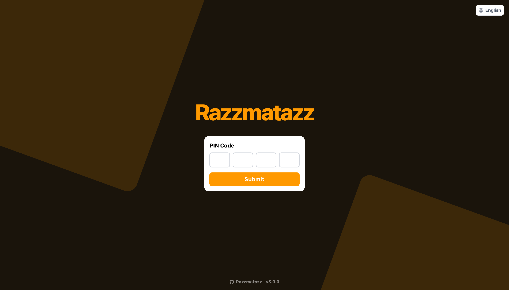
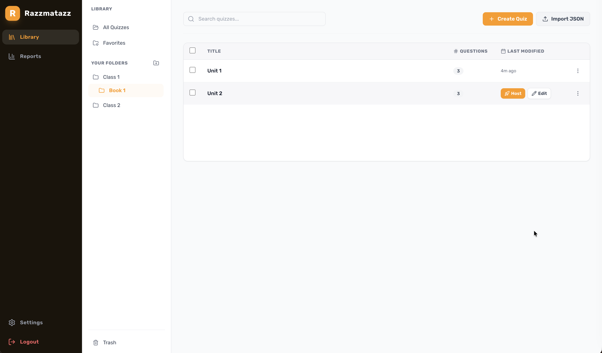

<p align="center">
  
  <br>
  <div align="center">
    
    
  </div>
</p>

## 🧩 What is this project?

Razzmatazz is a straightforward and open-source scrambled sentence builder game, allowing teachers and hosts to run interactive multiplayer quizzes for language learning and events.

> **Disclaimer**: Razzmatazz is an independent, open-source software project. It is not affiliated with, endorsed by, or sponsored by any third-party quiz platform or service. Any resemblance to other quiz platforms is purely incidental.

<p align="center">
  
  
  
</p>

## 🆚 Razzmatazz vs. Razzia

Razzmatazz is built on top of the open-source **Razzia** quiz platform (originally developed by [Ralex91](https://github.com/Ralex91/Razzia)). While it shares Razzia's robust real-time communication foundation, Razzmatazz has been heavily adapted and redesigned for language education:

- **Specialized Question Format**: Instead of standard multiple-choice questions, Razzmatazz is custom-built for scrambled sentence building. Questions use `scrambledChunks`, `correctChunks`, and `correctSentence` properties to support sentence reconstruction.
- **Premium Three-Column Manager Dashboard**: Features a completely redesigned full-screen admin control center.
- **Practice Mode**: Supports a relaxed study mode configuration where timer restrictions are lifted (setting countdown to 9999) to let students learn at their own pace.

## ⚙️ Prerequisites

Choose one of the following deployment methods:

### Without Docker

- Node.js : version 22 or higher
- PNPM : version 10.16 or higher (learn more [here](https://pnpm.io/))

### With Docker

- Docker and Docker Compose

## 📖 Getting Started

Choose your deployment method:

### 🐳 Using Docker (Recommended)

To run the application with your latest local updates, you will need to build the Docker image locally.

Using Docker Compose (recommended):
You can find the docker compose configuration in the repository:
[docker-compose.yml](/compose.yml)

```bash
docker compose up --build -d
```

Or using Docker directly:

```bash
# Build the image locally
docker build -t razzmatazz:latest .

# Run the container
docker run -d \
  -p 3000:3000 \
  -v ./config:/app/config \
  razzmatazz:latest
```

**Configuration Volume:**
The `-v ./config:/app/config` option mounts a local `config` folder to persist your game settings and quizzes. This allows you to:

- Edit your configuration files directly on your host machine
- Keep your settings when updating the container
- Easily backup your quizzes and game configuration

The folder will be created automatically on first run with an example quiz to get you started.

The application will be available at http://localhost:3000

### 🛠️ Without Docker

1. Clone the repository:

```bash
git clone https://github.com/All-English/Razzmatazz.git
cd ./Razzmatazz
```

2. Install dependencies:

```bash
pnpm install
```

3. Build and start the application:

```bash
# Development mode
pnpm run dev

# Production mode
pnpm run build
pnpm start
```

## ⚙️ Configuration

The configuration is split into two main parts:

### 1. Game Configuration (`config/game.json`)

Main game settings:

```json
{
  "managerPassword": "PASSWORD"
}
```

Options:

- `managerPassword`: The master password for accessing the manager interface. **Must be changed from the default `"PASSWORD"` value**, otherwise manager access is blocked.

### 2. Quiz Configuration (`config/quizz/*.json`)

Quizzes can be created in two ways:

- **Via the Quiz Editor** — use the built-in editor available in the manager dashboard (recommended)
- **Via JSON files** — manually create files in the `config/quizz/` directory

You can have multiple quiz files and select which one to use when starting a game.

Example quiz configuration (`config/quizz/example.json`):

```json
{
  "subject": "Example Quiz",
  "questions": [
    {
      "prompt": "그것은 큰 가스 덩어리야.",
      "scrambledChunks": ["of gas.", "It", "a big ball", "is"],
      "correctChunks": ["It", "is", "a big ball", "of gas."],
      "correctSentence": "It is a big ball of gas.",
      "cooldown": 5,
      "time": 30
    },
    {
      "prompt": "나는 학교에 갑니다.",
      "scrambledChunks": ["go", "I", "school.", "to"],
      "correctChunks": ["I", "go", "to", "school."],
      "correctSentence": "I go to school.",
      "cooldown": 5,
      "time": 30
    },
    {
      "prompt": "그녀는 빨간 사과를 좋아해요.",
      "scrambledChunks": ["red apples.", "She", "likes"],
      "correctChunks": ["She", "likes", "red apples."],
      "correctSentence": "She likes red apples.",
      "media": {
        "type": "image",
        "url": "https://placehold.co/600x400.png"
      },
      "cooldown": 5,
      "time": 30
    }
  ]
}
```

Quiz Options:

- `subject`: Title/topic of the quiz
- `questions`: Array of question objects containing:
  - `prompt`: The prompt, clue, or translation shown to the players
  - `scrambledChunks`: Array of scrambled word/phrase chunks presented to players to build the sentence
  - `correctChunks`: Array of the chunks in the correct sequence
  - `correctSentence`: The full correct sentence reconstructed by the chunks
  - `media`: Optional media object displayed with the question:
    - `type`: `"image"`, `"video"`, or `"audio"`
    - `url`: URL of the media
  - `cooldown`: Time in seconds before players can start building the sentence (3-15)
  - `time`: Time in seconds allowed to build the sentence (5-120, or 9999 for Study Mode/no time limit)

## 🎮 How to Play

1. Access the manager interface at http://localhost:3000/manager
2. Enter the manager password (defined in `config/game.json`)
3. Share the game URL (http://localhost:3000) and room code with participants
4. Wait for players to join
5. Click the start button to begin the game

## 📝 Contributing

Contributions are welcome! Please read the [CONTRIBUTING.md](.github/CONTRIBUTING.md) guide before submitting a pull request.

For bug reports or feature requests, please [create an issue](https://github.com/All-English/Razzmatazz/issues).

## ⭐ Star History

[](https://www.star-history.com/#All-English/Razzmatazz&type=date&legend=bottom-right)
