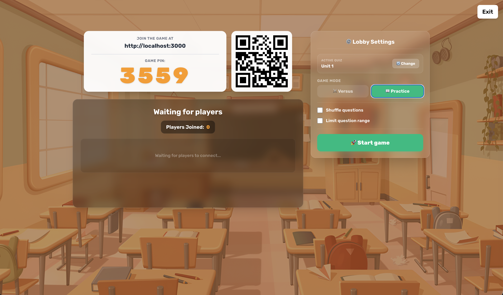

<p align="center">
  
  <br>
  <div align="center">
    
    
  </div>
</p>

## What is this project?

**Razzmatazz** is a straightforward, open-source scrambled sentence builder game. It lets teachers and hosts run interactive, real-time multiplayer quizzes where players piece sentences back together chunk by chunk.

### The Backstory: Why Razzmatazz?
I teach English to students in Korea, and one of the biggest hurdles my students face is **sentence structure**. They know the vocabulary, but putting the words together in the correct order is a constant challenge. 

I was inspired by a feature in a popular language-learning app (you know, the one with the green owl!) where you see a translation and have to build the sentence in the target language. I wanted a way for my students to practice exactly that—but in a fun, interactive, multiplayer classroom environment. 

After searching for a good starting point, I found **Razzia** (a fantastic open-source quiz game) and decided to adapt and redesign it to fit this sentence-building pedagogy. Thus, Razzmatazz was born!

> [!NOTE]
> 🛠️ **Built with AI (Vibe Coded)**
> Just a heads up: This project was built with the help of AI pair-programming (aka vibe coding). It works wonderfully in the classroom and has a polished UI, but since I am an English teacher and not a professional developer, you might spot some "creative" code structures under the hood!

<p align="center">
  
  
  <br>
  
  
</p>

## Razzmatazz vs. Razzia

Razzmatazz is built on top of the open-source **Razzia** quiz platform (originally developed by [Ralex91](https://github.com/Ralex91/Razzia)). While it shares Razzia's robust real-time communication foundation, Razzmatazz has been heavily adapted and redesigned for language education.

Here are the key improvements and additions in Razzmatazz:

### Core Gameplay & Formats
* **Scrambled Sentence Builder**: Instead of traditional multiple-choice questions, Razzmatazz is custom-built for language reconstruction. Players click or tap scrambled word chunks in sequence to build sentences.
* **Practice Mode**: A relaxed, untimed study configuration. Timer countdowns are lifted so students can build sentences at their own pace, checking answers as they go.
* **Versus Mode**: A competitive multiplayer game mode. Students race against each other in real-time to build sentences, tracking points and streaks.

### Redesigned Manager Experience
* **New Manager Dashboard**: A brand new, full-screen dashboard for quiz management.
* **Library Folders & Organization**: Easily sort quizzes by name, group them into folders, and toggle favorites.
* **Game Lobby**: A brand new, full-screen lobby for game management.
* **AI-Assisted Story Import**: Paste any paragraph or story, and use AI integration to automatically translate all sentences to generate translation prompts instantly.

### Player-Facing Polish
* **Slideshow Waiting Room**: Instead of a simple spinning loading circle, players waiting in the lobby see a smooth slideshow showing the quiz's sentences one by one so they can start previewing the material.
* **State Restoration**: Robust reconnection handling that preserves active game modes (e.g., Versus mode and Early End buttons) if the manager or player gets disconnected and rejoins mid-game.

## Getting Started

Choose your preferred deployment method below:

### Option A: Using Docker (Recommended)

**Prerequisites:** Docker and Docker Compose

Using Docker Compose is the easiest way to run Razzmatazz.

1. Download the [compose.yml](https://raw.githubusercontent.com/All-English/Razzmatazz/main/compose.yml) file to a new folder.
2. In the same folder, create a `.env` file and set your custom manager password (required to access the manager dashboard):
   ```env
   MANAGER_PASSWORD=your_secure_password
   ```
3. Run the container:
   ```bash
   docker compose up -d
   ```

Or using Docker directly:

```bash
docker run -d \
  --name razzmatazz \
  --restart unless-stopped \
  --init \
  -p 3050:3000 \
  -e MANAGER_PASSWORD=your_secure_password \
  -v razzmatazz-config:/app/config \
  ghcr.io/all-english/razzmatazz:latest
```

> **Configuration Volume:** The Docker setups automatically mount a configuration volume to persist your game settings and quizzes. The volume will be initialized automatically on first run with an example quiz to get you started.

The application will be available at http://localhost:3050.

### Option B: Without Docker (Node.js)

**Prerequisites:** Node.js v22+ and PNPM v10.16+

1. First, clone the repository and navigate into the project directory:
```bash
git clone https://github.com/All-English/Razzmatazz.git
cd ./Razzmatazz
```

2. Install dependencies:
```bash
pnpm install
```

2. Build and start the application:
```bash
# Development mode
pnpm run dev

# Production mode
pnpm run build
pnpm start
```

The application will be available at http://localhost:3000.

## How to Play

Once you have Razzmatazz running (either via Docker or Node.js):

1. Access the manager interface at `http://<your-ip>:3050/manager` (or `:3000/manager` if not using Docker).
2. Enter the manager password (by default, it is `"PASSWORD"`, see configuration instructions below).
3. Open a quiz from your library and click the **Host** button.
4. Share the game URL and PIN code displayed in the lobby with participants.
5. Wait for players to join on their devices, and click **Start Game** to begin!

## ⚙️ Configuration

### 1. Setting the Manager Password

For security, the manager interface requires a password. The application determines the password using this priority:
1. **Environment Variable (`MANAGER_PASSWORD`)** (Overrides file config)
2. **Configuration File (`config/game.json`)** -> `"managerPassword"`
3. **Default Value (`"PASSWORD"`)** (Access is blocked if left as default)

Here is how to set the password based on your installation type:

#### With Docker (Recommended)
You can set the password directly via environment variables.

* **Using Docker Compose**:
  You can set this in one of two ways:
  * **Option 1 (Recommended)**: Create a `.env` file in the same directory as your `compose.yml` and define your password:
    ```env
    MANAGER_PASSWORD=your_secure_password
    ```
    Docker Compose will automatically detect and inject it.
  * **Option 2**: Directly edit the `compose.yml` file and hardcode your password in the `environment` section:
    ```yaml
    environment:
      - MANAGER_PASSWORD=your_secure_password
    ```

* **Using Docker CLI**:
  Pass the password as an environment variable using the `-e` flag:
  ```bash
  docker run -d \
    --name razzmatazz \
    --restart unless-stopped \
    --init \
    -p 3050:3000 \
    -e MANAGER_PASSWORD=your_secure_password \
    -v razzmatazz-config:/app/config \
    ghcr.io/all-english/razzmatazz:latest
  ```

#### Without Docker (Bare Metal)
If you run the app directly on your host system:

* **Using the Configuration File (Recommended for Production)**:
  Edit the configuration file at `config/game.json` on your local filesystem:
  ```json
  {
    "managerPassword": "your_secure_password"
  }
  ```

* **Using a `.env` File (Recommended for Development)**:
  Create a `.env` file in the root of the repository and specify the password:
  ```env
  MANAGER_PASSWORD=your_secure_password
  ```

### 2. Managing Quizzes (`config/quizz/*.json`)

Quizzes can be created and managed in two ways:

* **Via the Quiz Editor (Recommended)**: Use the built-in, intuitive UI editor available right in the manager dashboard.
* **Via JSON files**: Manually create or edit JSON files directly in the `config/quizz/` directory.

<details>
<summary><b>Click here to view the raw JSON Quiz format structure</b></summary>

Example quiz configuration (`config/quizz/example.json`):

```json
{
  "subject": "Example Quiz",
  "questions": [
    {
      "prompt": "그것은 큰 가스 덩어리야.",
      "scrambledChunks": ["of gas.", "It", "a big ball", "is"],
      "correctChunks": ["It", "is", "a big ball", "of gas."],
      "correctSentence": "It is a big ball of gas.",
      "cooldown": 5,
      "time": 30
    },
    {
      "prompt": "나는 학교에 갑니다.",
      "scrambledChunks": ["go", "I", "school.", "to"],
      "correctChunks": ["I", "go", "to", "school."],
      "correctSentence": "I go to school.",
      "cooldown": 5,
      "time": 30
    },
    {
      "prompt": "그녀는 빨간 사과를 좋아해요.",
      "scrambledChunks": ["red apples.", "She", "likes"],
      "correctChunks": ["She", "likes", "red apples."],
      "correctSentence": "She likes red apples.",
      "media": {
        "type": "image",
        "url": "https://placehold.co/600x400.png"
      },
      "cooldown": 5,
      "time": 30
    }
  ]
}
```

**Quiz Options:**
- `subject`: Title/topic of the quiz
- `questions`: Array of question objects containing:
  - `prompt`: The prompt, clue, or translation shown to the players
  - `scrambledChunks`: Array of scrambled word/phrase chunks presented to players to build the sentence
  - `correctChunks`: Array of the chunks in the correct sequence
  - `correctSentence`: The full correct sentence reconstructed by the chunks
  - `media`: Optional media object displayed with the question (`type`: `"image"`, `"video"`, or `"audio"`, and `url`)
  - `cooldown`: Time in seconds before players can start building the sentence (3-15)
  - `time`: Time in seconds allowed to build the sentence (5-120, or 9999 for Study Mode/no time limit)
</details>

### 3. PWA Deep-Linking (Advanced Configuration)

If you install Razzmatazz as a Progressive Web App (PWA) on your tablets or devices, you can configure it to automatically open direct links — such as when scanning a game lobby QR code with the device's native camera app — directly inside the installed PWA window, rather than a standard browser tab.

**To enable this:**
1. Set the `APP_DOMAIN` environment variable to your actual hosting domain (e.g., `APP_DOMAIN=https://razzmatazz.myhomelab.net` or `APP_DOMAIN=http://192.168.1.100`).
   * **With Docker**: Set this inside `compose.yml` under `environment:`, or via `-e APP_DOMAIN=...` in `docker run`. The verification file will be served automatically.
   * **Without Docker**: Set this variable **before running the build step** (e.g., `APP_DOMAIN=... pnpm run build`) so it is embedded into the app at compile time.
2. If you are using a reverse proxy (e.g., Nginx, Cloudflare Tunnels, Caddy), ensure your proxy is configured to pass requests for `/.well-known/web-app-origin-association` through to the container, as some proxies block dotfile paths by default.
